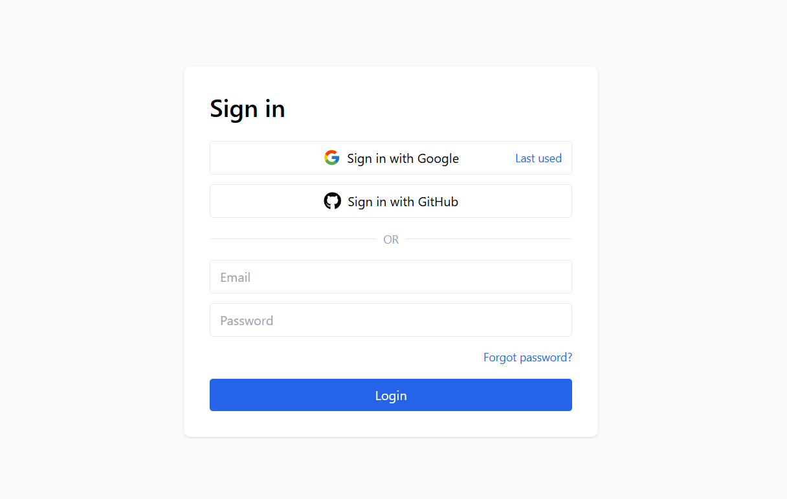
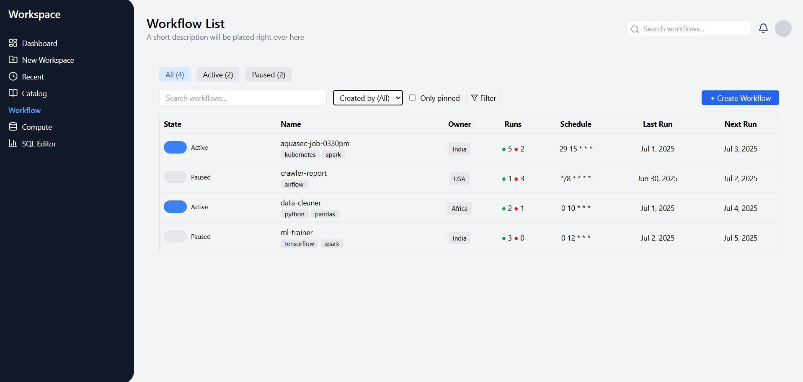

# Login & Workflow Dashboard (React + Typescript with Node.js API)

This project demonstrates a simple login system followed by a workflow dashboard.  
After a successful login, the dashboard displays a list of workflows with filtering, state toggling, and basic UI components.

---

## 📸 Screenshots

### Login Page

### Workflow Dashboard

---

## Tech Stack

### **Frontend**
- React
- TypeScript
- Tailwind CSS
- React Icons

### **Backend**
- Node.js
- Express.js

---

✔ Backend APIs:
- `POST /api/login`  
- `GET /api/workflows`

